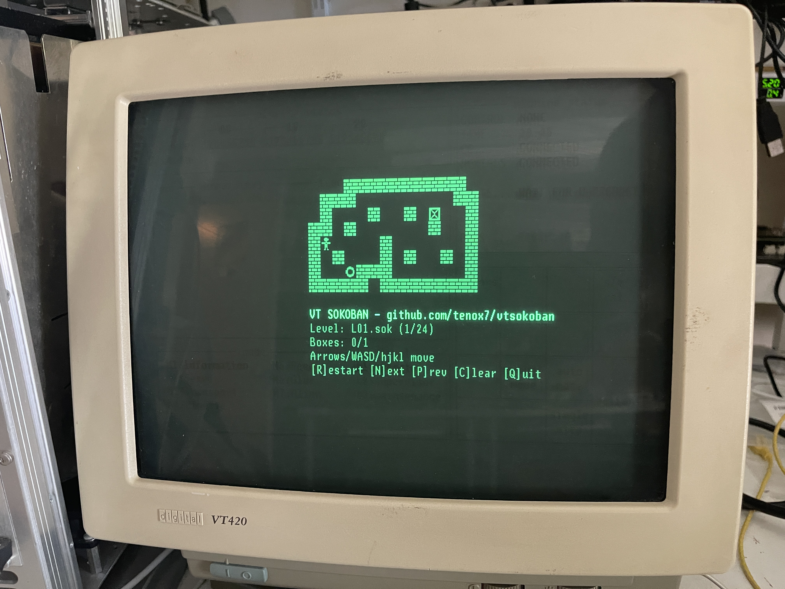

# VT Sokoban (DEC VT DRCS edition)



Sokoban for DEC VT300-series and later terminals, drawn with a downloadable soft
font (DRCS) rather than ASCII. Not just the board: the `VT SOKOBAN` title, the
seven-segment level and box counters and the key caps are all custom glyphs too.
No curses, no libraries — raw escape sequences and a diffed cell buffer, so it's
playable over a serial line.

The whole game is built from one unit: an 8x16 art cell that becomes exactly one
DRCS glyph. A map tile is 2 cells, a logo letter is 2x2, a digit or key cap is
2x1. `mktiles` interns duplicate cells, so the entire font — board, logo,
counters and caps — is 67 of the terminal's 94 slots and downloads once at
startup (~4KB, a couple of seconds on a slow line).

## Requirements

- C compiler
- VT320/330/340/420/510/520, or an emulator with DECDLD soft-font support

## Building

```
make
```

## Running

```
./vtsokoban
```

Terminal geometry is auto-detected via DA1/DA2. Flags:

```
  -t 320|340|420  Force font geometry, skip the DA probe
  -w 5..15        Override DRCS glyph width to match emulator cell grid
  -noquery        Skip the DA1/DA2 probe
  -shot FILE      Dump an ASCII approximation of level 1 and exit
  -h              Help
```

If your terminal reports no DRCS support, force a font: `./vtsokoban -t 340`.

## Controls

- Move: arrows, WASD, or HJKL
- `R` restart, `N` next, `P` previous
- `C` redraw, `Q` quit

## Font check

`make demo` writes `soko_demo{420,340,320}.vt`, a screen with every glyph the
game can draw on it. `cat` the matching one to your terminal: if any of it comes
out as letters instead of graphics, the terminal is not loading the soft font.

```
make demo
cat soko_demo340.vt
```

## Art

All hand-drawn 1-bit pixel art in `mktiles.c`: 16x16 map tiles, a bold 16x32
letter per logo character, and the key caps. The counters are generated from a
seven-segment table. Edit any of it and run `make` to regenerate `soko_tiles.h`;
`mktiles -p out.pgm` writes a preview of the assembled art so you can look at it
without a terminal.

The 8x16 -> glyph resampler exists twice, in `mktiles.c` and `vt_term.c`. The two
must stay identical.

## Levels

"sokohard" format from https://github.com/mezpusz/sokohard, embedded from
`levels/` by `embed_levels`. See `generate_level.sh`.

## License

Public Domain
