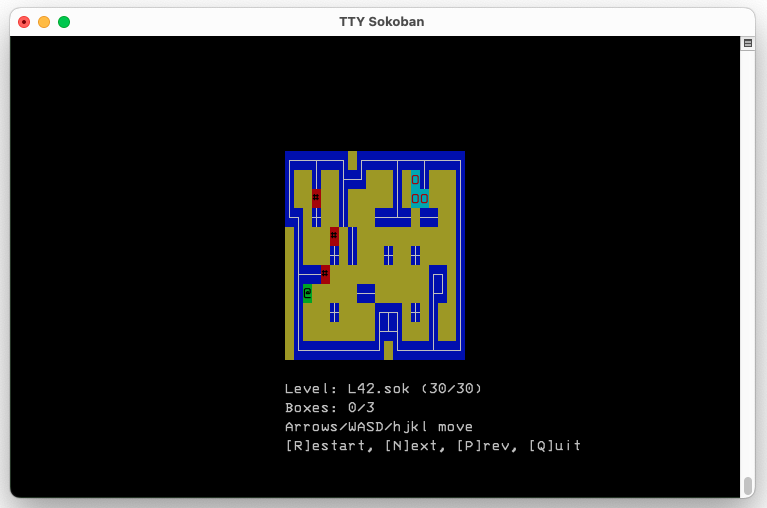

# VT Sokoban (DEC VT DRCS edition)



A terminal Sokoban game for **DEC VT300-series (and later) terminals**, rendered
with a downloadable soft font (DRCS) instead of ASCII/curses. Every map cell is
a 16x16 pixel tile drawn as two adjacent soft-font characters: cobblestone
walls, wooden crates, target diamonds and a little worker.

The approach is borrowed from [VT City](https://github.com/tenox7/vtcity): raw
escape sequences, locking-shift charset switching (G0 ASCII / G1 DRCS / G2 DEC
Special Graphics) and a diffed cell buffer that sends only what changed, so it
stays playable over a slow serial line. There is **no curses**. Because Sokoban
has only 7 tile types (13 unique 8x16 half-glyphs), the whole font is downloaded
once at startup and stays resident in the terminal's DRCS slots.

## Requirements

- A C compiler (GCC/Clang)
- A DEC **VT320 / VT330 / VT340 / VT420 / VT510 / VT520** terminal, or an
  emulator with DECDLD soft-font support. (No third-party libraries.)

## Building

```
make
```

This compiles the `mktiles` and `embed_levels` host tools, generates
`soko_tiles.h` (the tile bitmaps) and `embedded_levels.h`, then builds the game
from `vtsokoban.c` + `vt_term.c`.

## Running

```
./vtsokoban
```

The game probes the terminal (DA1/DA2) to pick the right glyph geometry. Flags:

```
  -t 320|340|420  Force the font geometry, skipping the DA probe
  -w 5..15        Override DRCS glyph width to match an emulator's cell grid
  -noquery        Skip the DA1/DA2 terminal probe
  -shot FILE      Headless: dump an ASCII approximation of level 1 and exit
  -h              Help
```

If a terminal reports no DRCS support, force a font with `-t`, e.g.
`./vtsokoban -t 340`.

## Controls

- Move: Arrow keys, WASD, or HJKL
- `R` restart level, `N` next, `P` previous
- `C` force redraw, `Q` quit

## Checking the font on real hardware

`make demo` writes `soko_demo{420,340,320}.vt` — raw escape-sequence files that
download the tiles and draw a sample board. `cat` one (matching your terminal)
straight to the terminal to verify the soft font before playing:

```
make demo
cat soko_demo340.vt      # on/over a VT340
```

## Tiles

The art is hand-drawn 1-bit 16x16 pixel tiles in `mktiles.c`, modelled on the
classic Thinking-Rabbit skin. Edit the pixel maps there and run `make` to
repackage `soko_tiles.h`.

## Levels

Levels use the "sokohard" format from https://github.com/mezpusz/sokohard,
embedded from the `levels/` directory by `embed_levels`. See
`generate_level.sh`.

## License

VT Sokoban is Public Domain
